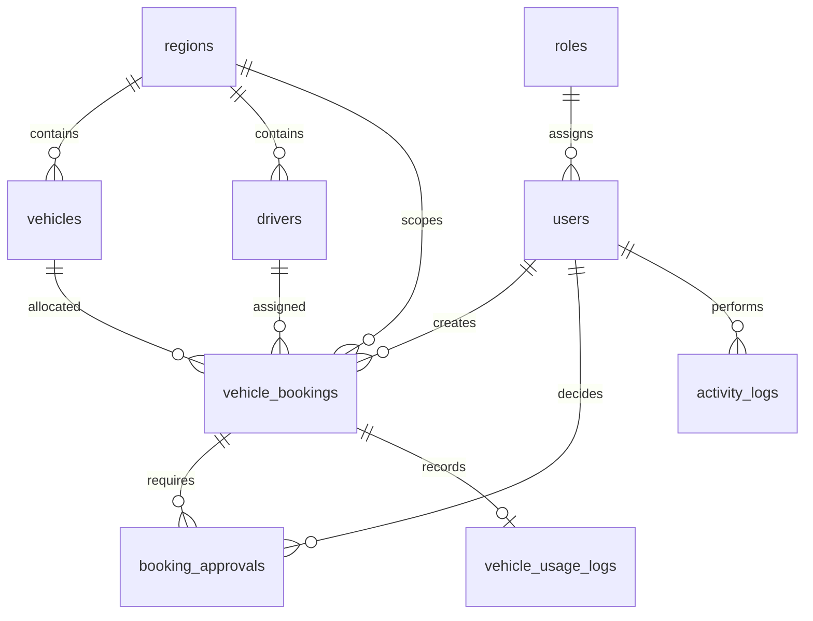

# Physical Data Model

| Table | Purpose | Important constraints |
|---|---|---|
| `roles` | Admin/approver role master | unique `code` |
| `users` | Login identities and approval level | unique `email`; optional `approval_level` |
| `regions` | Operational location master | unique `code` |
| `vehicles` | Fleet master | unique vehicle code/plate; operational status |
| `drivers` | Driver master | unique license number; active flag |
| `vehicle_bookings` | Travel request and lifecycle | unique booking number; indexed vehicle/driver time range |
| `booking_approvals` | Generic sequential decisions | unique `(booking_id, approval_level)` |
| `vehicle_usage_logs` | Completed vehicle usage | one record per booking |
| `activity_logs` | Append-only audit trail | indexed module/entity pair |
