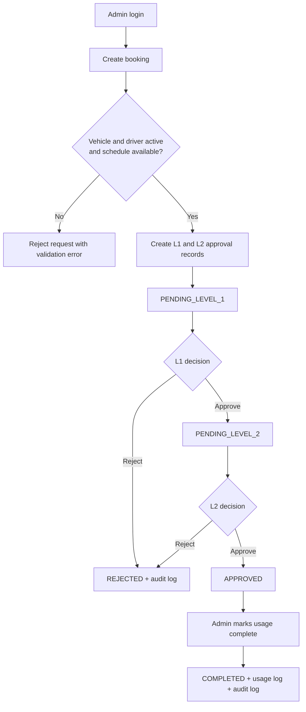

# Activity Diagram — Booking & Approval

```mermaid
flowchart TD
  A[Admin login] --> B[Create booking]
  B --> C{Vehicle and driver active\nand schedule available?}
  C -- No --> D[Reject request with validation error]
  C -- Yes --> E[Create L1 and L2 approval records]
  E --> F[PENDING_LEVEL_1]
  F --> G{L1 decision}
  G -- Reject --> R[REJECTED + audit log]
  G -- Approve --> H[PENDING_LEVEL_2]
  H --> I{L2 decision}
  I -- Reject --> R
  I -- Approve --> J[APPROVED]
  J --> K[Admin marks usage complete]
  K --> L[COMPLETED + usage log + audit log]
```
